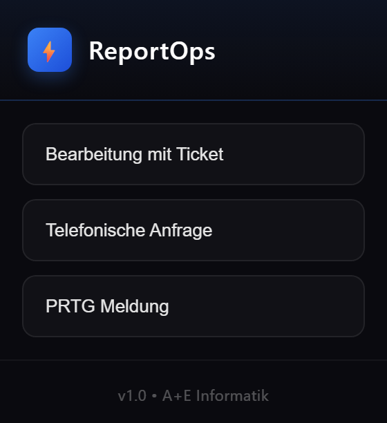
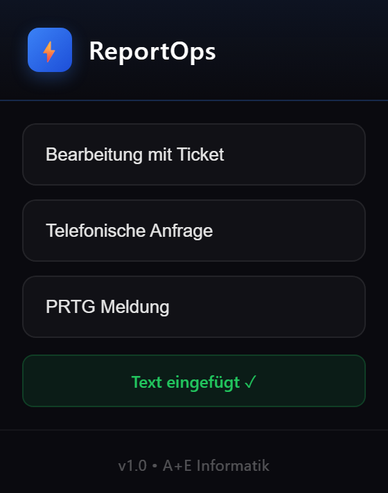
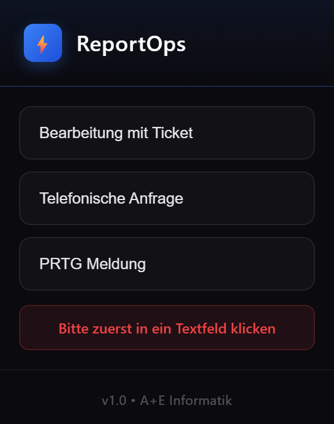

# ReportOps

Kleines Hilfswerkzeug für den Support-Alltag. Mit einem Klick wird ein **vorbereiteter Berichtstext** in das aktive Textfeld eingefügt, zum Beispiel beim Dokumentieren von Tickets, Telefonanfragen oder Monitoring-Meldungen. Das spart Zeit und sorgt für einheitliche Einträge.

> Entwickelt während meines Praktikums.

## Was das Tool macht

- Drei Vorlagen stehen zur Auswahl: **Bearbeitung mit Ticket**, **Telefonische Anfrage** und **PRTG Meldung**.
- Ein Klick fügt den Text in das Textfeld ein, in das zuvor geklickt wurde.
- Die Rückmeldung ist eindeutig: «Text eingefügt» bei Erfolg, sonst der Hinweis «Bitte zuerst in ein Textfeld klicken».
- Dunkles, schlichtes Design.

## Screenshots

### Übersicht

### Text eingefügt

### Hinweis, wenn kein Textfeld aktiv ist

